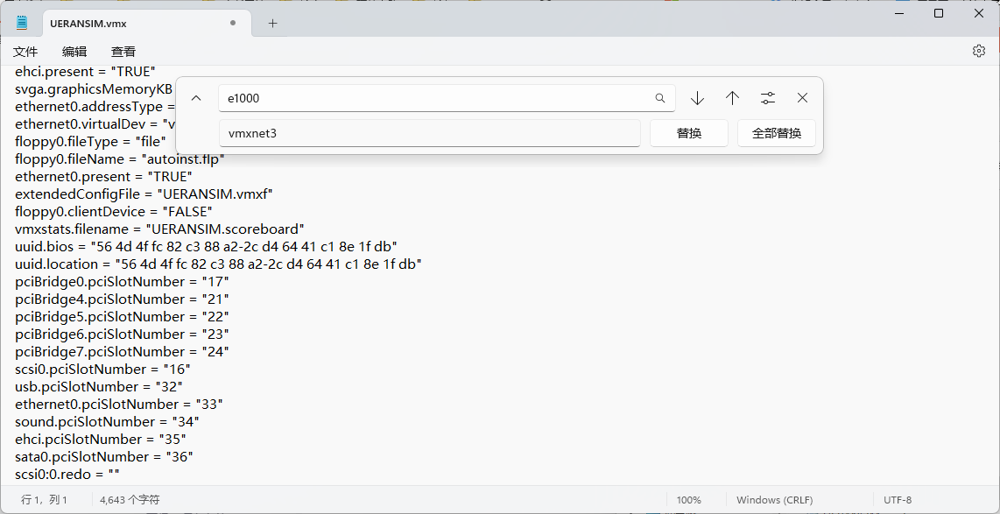
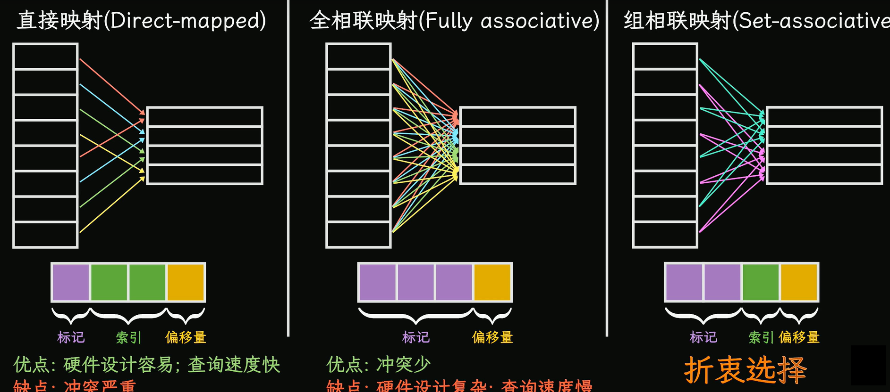
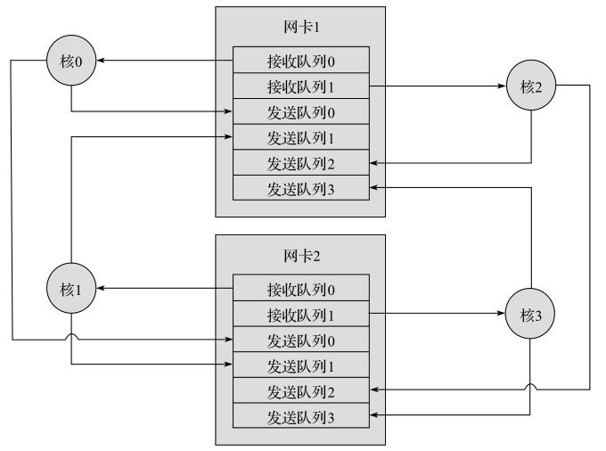
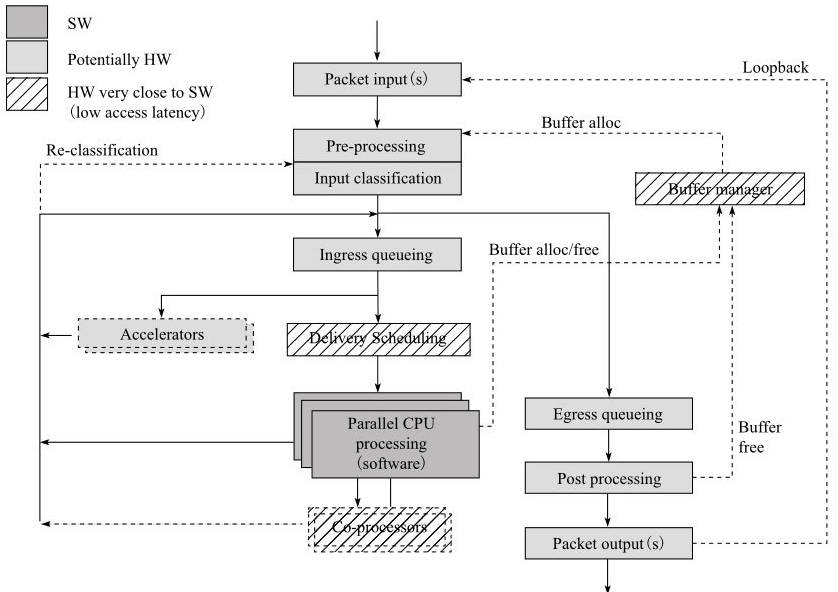
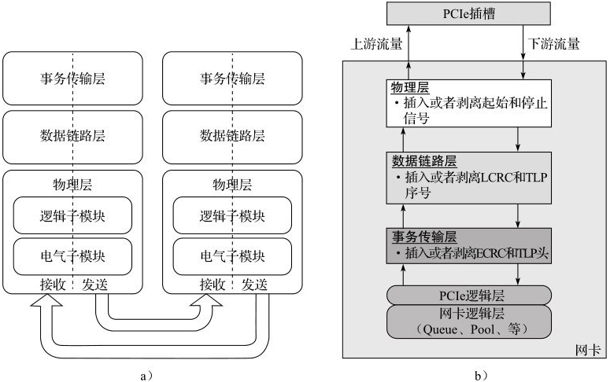
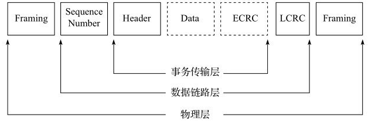
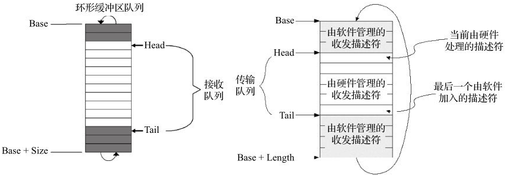

# 零. DPDK

DPDK（Data Plane Development Kit）

DPDK（数据平面开发套件）是一种高效的软件库和驱动程序集合，用于在Linux平台上快速处理数据包。这个工具主要面向网络应用，特别是那些需要高吞吐量和低延迟的应用，比如高频交易、网络功能虚拟化（NFV）和云计算。

### DPDK基础概念

1. **快速数据包处理**：DPDK通过绕过传统的操作系统网络堆栈，直接在用户空间处理数据包，大大提高了数据处理速度。

2. **内存管理**：DPDK使用了一种特殊的内存管理技术，称为Hugepages（大页），它有助于减少页面交换，从而提高性能。

3. **轮询模式驱动**：与传统的基于中断的网络处理不同，DPDK采用轮询模式（PMD），这意味着它不断地检查网络接口是否有新的数据包，从而减少了延迟。

### 典型用途

- **高性能网络应用**：DPDK被广泛应用于需要极高网络性能的应用中，如数据中心、云计算基础设施和网络安全解决方案。

- **网络功能虚拟化**：在NFV领域，DPDK可以帮助虚拟化网络功能，例如虚拟交换机、路由器和防火墙。

### 学习资源和第一步

1. **官方文档**：访问[DPDK官网](https://www.dpdk.org/)，阅读官方文档，了解其架构和API。

2. **教程和课程**：网上有许多DPDK的入门教程和课程，这些通常会从基础开始教授DPDK的使用。

3. **实践练习**：安装DPDK并在你的系统上尝试一些基本的例子。实践是学习DPDK的最佳方式。

4. **社区和论坛**：加入DPDK相关的社区和论坛，与其他DPDK用户和开发者交流。

### 简单例子或类比

可以把DPDK看作是一辆为网络数据专门设计的高速赛车。在普通道路（传统网络堆栈）上，车辆（数据包）必须遵守交通规则和信号灯，这导致速度较慢。DPDK则创建了一条直接的、无信号灯的专用赛道（用户空间直接处理），使数据包能以最快速度直达目的地。

希望这些信息能帮助您开始学习DPDK。如果您有更具体的问题或需要更深入的解释，请随时提问。


<hr size="5" color="#33ffff">

在DPDK的上下文中，以下是几个关键概念的解释：

**轮询模式驱动（PMD）**

轮询模式驱动（PMD）是DPDK的一个重要组成部分，其设计旨在避免不必要的中断处理开销。PMD通常为每个核心分配专用资源，例如，每个核心的每个端口都有独立的发送队列。此外，为了遵循非一致性内存访问（NUMA）原则，内存管理设计为将私有缓冲池分配给每个逻辑核心的本地内存，以最小化远程内存访问。

**用户态驱动**

DPDK的用户空间轮询模式驱动（PMD）和API集合使得网络设备能够完全在用户空间进行配置和操作，而无需通过内核空间。这种方式允许DPDK应用程序直接与硬件交互，提高了性能和效率。

**亲和性与独占**

为了减少上下文切换的可能性，可以使用Linux的`isolcpus`参数将DPDK应用程序线程分配到特定的核心。例如，如果DPDK应用程序运行在逻辑核心1、2和3上，可以在内核参数列表中添加`isolcpus=1,2,3`。同时，多个逻辑核心不应共享接收或发送队列，因为这会要求全局锁定并降低性能

**降低访存开销**

DPDK通过优化内存访问模式来降低访存开销。一个例子是NUMA（非一致性内存访问）设置，当启用NUMA时，所有的内存访问都发生在同一套接字（本地）内存中，没有跨越QPI链接，这显著减少了内存访问的延迟，从而提高了性能。

**软件调优**

DPDK应用程序的性能优化需要考虑多个方面，包括内存预取和I/O模式的选择。例如，使用`PREFETCHW`和`PREFETCHWT1`指令可以优化内存访问，隐藏内存延迟。此外，正确的核心掩码参数选择也对减少处理器间通信成本至关重要，选择通信核心时应该考虑它们在物理上是否相邻。避免使用逻辑核心0进行DPDK任务也是一个常见的最佳实践，因为核心0通常被Linux系统使用。

<hr>

**DPDK源码目录结构**　

　　lib/ : DPDK的库源代码
　　drivers/ : DPDK轮询模式驱动程序源代码
　　app/ : DPDK应用程序源代码
　　examples/ : DPDK的一些应用程序例子源代码
　　config/ : DPDK关于arm和x86平台的一些编译配置
　　buildtools/ : DPDK一些编译配置的脚本
　　mk/ : DPDK的Makefile
　　usertools/ : DPDK提供给用户的一些实用工具

**常用术语及缩写**

　　ACL：Access Control List，访问控制列表，是路由器和交换机接口的指令列表，用来控制端口进出的数据包；简而言之就是用来控制数据流。
　　SSL：Secure Sockets Layer，安全套接层，是为网络通信提供安全及数据完整性的一种安全协议，在传输层对网络连接进行加密。
　　RSS：Receive Side Scaling，是一种能够在多处理器系统下使接收报文在多个CPU之间高效分发的网卡驱动技术。
　　NUMA：Non Uniform Memory Access Architecture，非统一内存访问架构；
　　QOS：Quality of Service，服务质量，指一个网络能够利用各种基础技术，为指定的网络通信提供更好的服务能力, 是网络的一种安全机制， 是用来解决网络延迟和阻塞等问题的一种技术。
　　NIC：Network Interface Card，网卡，网卡是局域网中最基本的部件之一，它是连接计算机与网络的硬件设备。
　　PCI：Peripheral Component Interconnect，计算机一种标准总线，NIC就是使用的这种总线方式。
　　PMD：Poll Mode Drive，轮询模式驱动，DPDK就是采用的这种模式。
　　RTE：Run Time Environment，通过PMD实现快速分组处理数据的一个框架。
　　MPLS：Multi-Protocol Label Switching，多协议标签交换，是一种用于快速数据包交换和路由的体系，它为网络数据流量提供了目标、路由地址、转发和交换等能力。更特殊的是，它具有管理各种不同形式通信流的机制。

# 一、Hello World

在DPDK中编写一个 "Hello World" 程序是开始学习DPDK的好方法。这个程序通常是最简单的程序，旨在展示如何初始化DPDK环境并执行基本任务。下面是一个简单的指南，帮助你入门。

## 1. 前提条件

1. **安装DPDK**：确保你的系统上已经安装了DPDK。你可以从[DPDK官网](https://www.dpdk.org/)下载并按照指导进行安装。

2. **环境配置**：配置你的系统以使用DPDK，包括设置Hugepages和绑定至少一个网络接口到DPDK兼容的驱动程序。

3. **Cmake:**

   ```cmake
   cmake_minimum_required(VERSION 3.0)
   
   # 设置项目名和版本
   project(dpdk_study VERSION 1.0)
   
   # 指定 C 标准
   set(CMAKE_C_STANDARD 11)
   set(CMAKE_C_STANDARD_REQUIRED True)
   
   # 查找 DPDK 包
   find_package(PkgConfig REQUIRED)
   pkg_check_modules(DPDK REQUIRED libdpdk)
   
   # 包含 DPDK 头文件路径
   include_directories(${DPDK_INCLUDE_DIRS})
   
   # 指定可执行文件和源文件
   add_executable(dpdk_study main.c)
   
   # 链接 DPDK 库
   target_link_libraries(dpdk_study ${DPDK_LIBRARIES})
   
   # 如果需要，链接其他库
   link_directories(${DPDK_LIBRARY_DIRS})
   ```

## 2. 编写Hello World程序

1. **包含必要的头文件**：
   
   ```c
   #include <rte_eal.h>
   #include <rte_log.h>
   #include <rte_debug.h>
   ```

2. **主函数（main）**：

- 初始化EAL（Environment Abstraction Layer，环境抽象层）。
- 打印 "Hello World" 消息。
- 清理并退出。

```c
int main(int argc, char **argv)
{
    // 初始化EAL
    if (rte_eal_init(argc, argv) < 0)
        rte_panic("EAL initialization failed\n");

    // 打印 Hello World
    printf("Hello, World!\n");

    // 清理EAL
    rte_eal_cleanup();

    return 0;
}
```

结果：

```bash
/home/ueransim/dpdk_study/cmake-build-debug/dpdk_study
EAL: Detected CPU lcores: 2
EAL: Detected NUMA nodes: 1
EAL: Detected shared linkage of DPDK
EAL: Multi-process socket /run/user/1000/dpdk/rte/mp_socket
EAL: Selected IOVA mode 'VA'
EAL: No free 2048 kB hugepages reported on node 0
EAL: FATAL: Cannot get hugepage information.
EAL: Cannot get hugepage information.
PANIC in main():
EAL initialization failed
0: /usr/local/lib/x86_64-linux-gnu/librte_eal.so.24 (rte_dump_stack+0x3e) [7f213d1245fe]
1: /usr/local/lib/x86_64-linux-gnu/librte_eal.so.24 (__rte_panic+0xc5) [7f213d1009c5]
2: /home/ueransim/dpdk_study/cmake-build-debug/dpdk_study (main+0x43) [560ed021a97d]
3: /lib/x86_64-linux-gnu/libc.so.6 (__libc_start_main+0xe7) [7f213cd23c87]
4: /home/ueransim/dpdk_study/cmake-build-debug/dpdk_study (_start+0x2a) [560ed021a85a]

Process finished with exit code 134
```

## 3. 例程中的helloworld

```c
#include <stdio.h>
#include <string.h>
#include <rte_launch.h>
#include <rte_eal.h>
#include <rte_lcore.h>
#include <rte_debug.h>

/* Launch a function on lcore. 8< */
static int
lcore_hello(__rte_unused void *arg)
{
    unsigned lcore_id;
    lcore_id = rte_lcore_id();
    printf("hello from core %u\n", lcore_id);
    return 0;
}
/* >8 End of launching function on lcore. */

/* Initialization of Environment Abstraction Layer (EAL). 8< */
int
main(int argc, char **argv)
{
    int ret;
    unsigned lcore_id;

    ret = rte_eal_init(argc, argv);
    if (ret < 0)
        rte_panic("Cannot init EAL\n");
    /* >8 End of initialization of Environment Abstraction Layer */

    /* Launches the function on each lcore. 8< */
    RTE_LCORE_FOREACH_WORKER(lcore_id) {
        /* Simpler equivalent. 8< */
        rte_eal_remote_launch(lcore_hello, NULL, lcore_id);
        /* >8 End of simpler equivalent. */
    }

    /* call it on main lcore too */
    lcore_hello(NULL);
    /* >8 End of launching the function on each lcore. */

    rte_eal_mp_wait_lcore();

    /* clean up the EAL */
    rte_eal_cleanup();

    return 0;
}

```

结果：

```bash
/home/ueransim/dpdk_study/cmake-build-debug/dpdk_study
EAL: Detected CPU lcores: 4
EAL: Detected NUMA nodes: 1
EAL: Detected shared linkage of DPDK
EAL: Multi-process socket /run/user/1000/dpdk/rte/mp_socket
EAL: Selected IOVA mode 'VA'
TELEMETRY: No legacy callbacks, legacy socket not created
hello from core 1
hello from core 2
hello from core 3
hello from core 0
```

**代码解释：**

```c
int rte_eal_init(int argc, char **argv);
```

主线程运行入口是main函数，调用了rte_eal_init入口函数，启动基础运行环境。

在 `main` 函数的这部分中，程序首先初始化 DPDK 的环境抽象层（EAL）。`rte_eal_init` 是初始化 DPDK 环境的关键函数，它接收来自命令行的参数，并设置 DPDK 所需的内存、日志等。如果初始化失败，程序将通过 `rte_panic` 输出错误消息并退出。

```c
RTE_LCORE_FOREACH_WORKER(lcore_id) {
    rte_eal_remote_launch(lcore_hello, NULL, lcore_id);
}
lcore_hello(NULL);
rte_eal_mp_wait_lcore();
```

在 DPDK 中，`lcore` 代表的是 "逻辑核心"（logical core）。DPDK 使用逻辑核心的概念来管理和执行不同的线程或任务。在多核处理器上，每个 CPU 核心可以被视为一个逻辑核心，DPDK 利用这些核心来并行处理数据包和执行其他网络操作。

```c
RTE_LCORE_FOREACH_WORKER(lcore_id) {
    rte_eal_remote_launch(lcore_hello, NULL, lcore_id);
}
```

- `RTE_LCORE_FOREACH_WORKER(lcore_id)` 是一个宏，用于遍历所有配置为工作 lcore 的逻辑核心。它不包括主 lcore。
- `rte_eal_remote_launch(lcore_hello, NULL, lcore_id)` 在每个工作 lcore 上启动 `lcore_hello` 函数。这意味着 `lcore_hello` 将在除主 lcore 外的每个 lcore 上异步执行。（多核运行初始化）
  * 第一个参数是从线程，是被征召的线程；
  * 第二个参数是传给从线程的参数；
  * 第三个参数是指定的逻辑核，从线程会执行在这个core上

```c
lcore_hello(NULL);
```

这一行是在主 lcore 上直接调用 `lcore_hello` 函数。主 lcore 通常用于控制和协调程序的主要流程，而不是用作工作 lcore。因此，这一行确保了 `lcore_hello` 函数也在主 lcore 上执行。

```c
rte_eal_mp_wait_lcore();
```

`rte_eal_mp_wait_lcore()` 用于等待所有工作 lcore 完成它们的任务。由于 `rte_eal_remote_launch` 是异步的，主 lcore 将继续执行，直到到达这个点。此函数确保主 lcore 在继续执行之前等待所有工作 lcore 完成它们的操作。

### **错误1：**

```bash
EAL: Detected CPU lcores: 4
EAL: Detected NUMA nodes: 1
EAL: Detected shared linkage of DPDK
EAL: Multi-process socket /run/user/1000/dpdk/rte/mp_socket
EAL: Selected IOVA mode 'VA'
EAL: No free 2048 kB hugepages reported on node 0
EAL: FATAL: Cannot get hugepage information.
EAL: Cannot get hugepage information.
PANIC in main():
EAL initialization failed
0: /usr/local/lib/x86_64-linux-gnu/librte_eal.so.24 (rte_dump_stack+0x3e) [7f213d1245fe]
1: /usr/local/lib/x86_64-linux-gnu/librte_eal.so.24 (__rte_panic+0xc5) [7f213d1009c5]
2: /home/ueransim/dpdk_study/cmake-build-debug/dpdk_study (main+0x43) [560ed021a97d]
3: /lib/x86_64-linux-gnu/libc.so.6 (__libc_start_main+0xe7) [7f213cd23c87]
4: /home/ueransim/dpdk_study/cmake-build-debug/dpdk_study (_start+0x2a) [560ed021a85a]

Process finished with exit code 134
```

您遇到的错误是在初始化 DPDK 环境抽象层（EAL）时发生的，具体来说是因为无法获取到足够的 Hugepages。DPDK 高性能操作依赖于 Hugepages，而您的系统上似乎没有配置或没有足够的 Hugepages 可用。

**解决方案:**

1. **配置 Hugepages**

   在 Linux 上，您可以通过以下命令配置 Hugepages。这里以配置 2048 KB 大小的 Hugepages 为例：

   ```bash
   sudo sh -c 'echo 1024 > /proc/sys/vm/nr_hugepages'
   ```

   这个命令将配置 1024 个 2048 KB 大小的 Hugepages。

2. **确认 Hugepages 配置**

   检查 Hugepages 是否正确配置：

   ```bash
   cat /proc/meminfo | grep HugePages_Total
   ```

   这应该显示非零的值，表示已配置的 Hugepages 总数。

3. **调整您的程序以匹配 Hugepages 设置**

   如果您的程序在初始化 EAL 时指定了特定的 Hugepages 大小或数量，确保这与您系统上配置的 Hugepages 相匹配。

4. **重新运行您的程序**

   在配置了 Hugepages 之后，重新运行您的 DPDK 程序。

**注意事项**

- 配置 Hugepages 需要 root 权限。
- Hugepages 的配置可能会受到系统内存大小和配置的限制。确保您的系统有足够的内存来配置所需的 Hugepages。
- 配置过多的 Hugepages 可能会影响系统的其它部分，因为它们会从系统总内存中划分出去。

如果在执行这些步骤后问题仍然存在，或者有任何其他疑问，请提供更多的上下文信息，以便进一步协助您。

### **错误2：**

```bash
EAL: Detected CPU lcores: 2
EAL: Detected NUMA nodes: 1
EAL: Detected shared linkage of DPDK
EAL: Multi-process socket /run/user/1000/dpdk/rte/mp_socket
EAL: Selected IOVA mode 'VA'
EAL: get_seg_fd(): open '/dev/hugepages/rtemap_0' failed: Permission denied
EAL: Couldn't get fd on hugepage file
EAL: error allocating rte services array
EAL: FATAL: rte_service_init() failed
EAL: rte_service_init() failed
PANIC in main():
EAL initialization failed
0: /usr/local/lib/x86_64-linux-gnu/librte_eal.so.24 (rte_dump_stack+0x3e) [7f1cd34145fe]
1: /usr/local/lib/x86_64-linux-gnu/librte_eal.so.24 (__rte_panic+0xc5) [7f1cd33f09c5]
2: /home/ueransim/dpdk_study/cmake-build-debug/dpdk_study (main+0x43) [55a2a602697d]
3: /lib/x86_64-linux-gnu/libc.so.6 (__libc_start_main+0xe7) [7f1cd3013c87]
4: /home/ueransim/dpdk_study/cmake-build-debug/dpdk_study (_start+0x2a) [55a2a602685a]
```

遇到的错误是因为 DPDK 程序无法访问 Hugepages 内存。错误信息 `open '/dev/hugepages/rtemap_0' failed: Permission denied` 表明程序试图访问 `/dev/hugepages` 目录时遭到了权限拒绝。这通常发生在试图以非 root 用户运行需要 Hugepages 访问权限的 DPDK 程序时。

**解决方案**

1. 以 Root 用户运行

尝试以 root 用户运行您的 DPDK 程序。因为 DPDK 需要特殊权限来访问 Hugepages 和执行某些网络操作。使用 `sudo` 来以 root 用户身份运行程序：

```bash
sudo /home/ueransim/dpdk_study/cmake-build-debug/dpdk_study
```

2. 调整 Hugepages 权限

如果因为某些原因您不能以 root 用户运行程序，您可以尝试更改 `/dev/hugepages` 的权限，允许您的用户访问这些 Hugepages。

```bash
sudo chmod 777 /dev/hugepages
```

或者，更安全地，只为特定用户或组设置权限：

```bash
sudo chown your_user:your_group /dev/hugepages
```

替换 `your_user` 和 `your_group` 为您的用户名和用户组。

3. 确保正确配置了 Hugepages

确认 Hugepages 已被正确配置并可供 DPDK 使用。您可以用以下命令检查当前配置的 Hugepages：

```bash
cat /proc/meminfo | grep HugePages_Total
```

4. 检查其他相关设置

- 确保您的用户有足够的权限来执行 DPDK 相关的操作。
- 如果您的应用涉及网络操作，还需要确认网络接口是否已被绑定到 DPDK 兼容驱动。

**注意事项**

- 运行网络应用程序或与硬件交互的应用程序通常需要 root 权限。
- 更改系统文件的权限可能会带来安全风险，请在了解这些操作的后果后谨慎进行。

# 二、Skeleton

最精简的单核报文收发骨架，也许这是当前世界上运行最快的报文进出测试程序。

```c
#include <stdint.h>
#include <stdlib.h>
#include <inttypes.h>
#include <rte_eal.h>
#include <rte_ethdev.h>
#include <rte_cycles.h>
#include <rte_lcore.h>
#include <rte_mbuf.h>

#define RX_RING_SIZE 1024
#define TX_RING_SIZE 1024

#define NUM_MBUFS 8191
#define MBUF_CACHE_SIZE 250
#define BURST_SIZE 32

/* basicfwd.c: Basic DPDK skeleton forwarding example. */

/*
 * Initializes a given port using global settings and with the RX buffers
 * coming from the mbuf_pool passed as a parameter.
 */

/* Main functional part of port initialization. 8< */
static inline int
port_init(uint16_t port, struct rte_mempool *mbuf_pool)
{
    struct rte_eth_conf port_conf;
    const uint16_t rx_rings = 1, tx_rings = 1;
    uint16_t nb_rxd = RX_RING_SIZE;
    uint16_t nb_txd = TX_RING_SIZE;
    int retval;
    uint16_t q;
    struct rte_eth_dev_info dev_info;
    struct rte_eth_txconf txconf;

    if (!rte_eth_dev_is_valid_port(port))
        return -1;

    memset(&port_conf, 0, sizeof(struct rte_eth_conf));

    retval = rte_eth_dev_info_get(port, &dev_info);
    if (retval != 0) {
        printf("Error during getting device (port %u) info: %s\n",
               port, strerror(-retval));
        return retval;
    }

    if (dev_info.tx_offload_capa & RTE_ETH_TX_OFFLOAD_MBUF_FAST_FREE)
        port_conf.txmode.offloads |=
                RTE_ETH_TX_OFFLOAD_MBUF_FAST_FREE;

    /* Configure the Ethernet device. */
    retval = rte_eth_dev_configure(port, rx_rings, tx_rings, &port_conf);
    if (retval != 0)
        return retval;

    retval = rte_eth_dev_adjust_nb_rx_tx_desc(port, &nb_rxd, &nb_txd);
    if (retval != 0)
        return retval;

    /* Allocate and set up 1 RX queue per Ethernet port. */
    for (q = 0; q < rx_rings; q++) {
        retval = rte_eth_rx_queue_setup(port, q, nb_rxd,
                                        rte_eth_dev_socket_id(port), NULL, mbuf_pool);
        if (retval < 0)
            return retval;
    }

    txconf = dev_info.default_txconf;
    txconf.offloads = port_conf.txmode.offloads;
    /* Allocate and set up 1 TX queue per Ethernet port. */
    for (q = 0; q < tx_rings; q++) {
        retval = rte_eth_tx_queue_setup(port, q, nb_txd,
                                        rte_eth_dev_socket_id(port), &txconf);
        if (retval < 0)
            return retval;
    }

    /* Starting Ethernet port. 8< */
    retval = rte_eth_dev_start(port);
    /* >8 End of starting of ethernet port. */
    if (retval < 0)
        return retval;

    /* Display the port MAC address. */
    struct rte_ether_addr addr;
    retval = rte_eth_macaddr_get(port, &addr);
    if (retval != 0)
        return retval;

    printf("Port %u MAC: %02" PRIx8 " %02" PRIx8 " %02" PRIx8
           " %02" PRIx8 " %02" PRIx8 " %02" PRIx8 "\n",
           port, RTE_ETHER_ADDR_BYTES(&addr));

    /* Enable RX in promiscuous mode for the Ethernet device. */
    retval = rte_eth_promiscuous_enable(port);
    /* End of setting RX port in promiscuous mode. */
    if (retval != 0)
        return retval;

    return 0;
}
/* >8 End of main functional part of port initialization. */

/*
 * The lcore main. This is the main thread that does the work, reading from
 * an input port and writing to an output port.
 */

/* Basic forwarding application lcore. 8< */
static __rte_noreturn void
lcore_main(void)
{
    uint16_t port;

    /*
     * Check that the port is on the same NUMA node as the polling thread
     * for best performance.
     */
    RTE_ETH_FOREACH_DEV(port)
        if (rte_eth_dev_socket_id(port) >= 0 &&
            rte_eth_dev_socket_id(port) !=
            (int)rte_socket_id())
            printf("WARNING, port %u is on remote NUMA node to "
                   "polling thread.\n\tPerformance will "
                   "not be optimal.\n", port);

    printf("\nCore %u forwarding packets. [Ctrl+C to quit]\n",
           rte_lcore_id());

    /* Main work of application loop. 8< */
    for (;;) {
        /*
         * Receive packets on a port and forward them on the paired
         * port. The mapping is 0 -> 1, 1 -> 0, 2 -> 3, 3 -> 2, etc.
         */
        RTE_ETH_FOREACH_DEV(port) {

            /* Get burst of RX packets, from first port of pair. */
            struct rte_mbuf *bufs[BURST_SIZE];
            const uint16_t nb_rx = rte_eth_rx_burst(port, 0,
                                                    bufs, BURST_SIZE);

            if (unlikely(nb_rx == 0))
                continue;

            /* Send burst of TX packets, to second port of pair. */
            const uint16_t nb_tx = rte_eth_tx_burst(port ^ 1, 0,
                                                    bufs, nb_rx);

            /* Free any unsent packets. */
            if (unlikely(nb_tx < nb_rx)) {
                uint16_t buf;
                for (buf = nb_tx; buf < nb_rx; buf++)
                    rte_pktmbuf_free(bufs[buf]);
            }
        }
    }
    /* >8 End of loop. */
}
/* >8 End Basic forwarding application lcore. */

/*
 * The main function, which does initialization and calls the per-lcore
 * functions.
 */
int
main(int argc, char *argv[])
{
    struct rte_mempool *mbuf_pool;
    unsigned nb_ports;
    uint16_t portid;

    /* Initializion the Environment Abstraction Layer (EAL). 8< */
    int ret = rte_eal_init(argc, argv);
    if (ret < 0)
        rte_exit(EXIT_FAILURE, "Error with EAL initialization\n");
    /* >8 End of initialization the Environment Abstraction Layer (EAL). */

    argc -= ret;
    argv += ret;

    /* Check that there is an even number of ports to send/receive on. */
    nb_ports = rte_eth_dev_count_avail();
    if (nb_ports < 2 || (nb_ports & 1))
        rte_exit(EXIT_FAILURE, "Error: number of ports must be even\n");

    /* Creates a new mempool in memory to hold the mbufs. */

    /* Allocates mempool to hold the mbufs. 8< */
    mbuf_pool = rte_pktmbuf_pool_create("MBUF_POOL", NUM_MBUFS * nb_ports,
                                        MBUF_CACHE_SIZE, 0, RTE_MBUF_DEFAULT_BUF_SIZE, rte_socket_id());
    /* >8 End of allocating mempool to hold mbuf. */

    if (mbuf_pool == NULL)
        rte_exit(EXIT_FAILURE, "Cannot create mbuf pool\n");

    /* Initializing all ports. 8< */
    RTE_ETH_FOREACH_DEV(portid)
        if (port_init(portid, mbuf_pool) != 0)
            rte_exit(EXIT_FAILURE, "Cannot init port %"PRIu16 "\n",
                     portid);
    /* >8 End of initializing all ports. */

    if (rte_lcore_count() > 1)
        printf("\nWARNING: Too many lcores enabled. Only 1 used.\n");

    /* Call lcore_main on the main core only. Called on single lcore. 8< */
    lcore_main();
    /* >8 End of called on single lcore. */

    /* clean up the EAL */
    rte_eal_cleanup();

    return 0;
}
```

错误：

```bash
EAL: Detected CPU lcores: 4
EAL: Detected NUMA nodes: 1
EAL: Detected shared linkage of DPDK
EAL: Multi-process socket /run/user/1000/dpdk/rte/mp_socket
EAL: Selected IOVA mode 'VA'
TELEMETRY: No legacy callbacks, legacy socket not created
EAL: Error - exiting with code: 1
  Cause: Error: number of ports must be even
```

指出端口必须为偶数。

## <strong style = "color:red">网卡绑定dpdk:</strong>

### 1. 更换高性能网卡

我们知道VMware的网络适配器类型有多种，例如E1000、VMXNET、 VMXNET 2 (Enhanced)、VMXNET3等，就性能而言，一般VMXNET3要优于E1000，下面介绍如果将Linux虚拟机的网络适配器类型从 E1000改为VMXNET3。

在数据存储浏览器中找到虚拟机对应的目录，找到*.vmx文件。找到参数ethernet1.virtualDev（有可能为ethernet0）将其值从"e1000"改为"vmxnet3"



> 注意：不要全部更换！仅仅要不就无法与外网通信了。

### 2. 加载**uio**和**uio_pci_generic**

您遇到的错误提示表明在尝试将网络接口 `ens38` 绑定到 DPDK 使用的 `uio_pci_generic` 内核模块时，该模块尚未加载到内核中。Data Plane Development Kit (DPDK) 需要特定的内核模块来控制网络接口。在这种情况下，您需要加载 `uio` 和 `uio_pci_generic` 模块。

请按照以下步骤操作：

1. **加载 UIO 模块**:
   首先，您需要加载 `uio` 模块。这是一个通用的用户空间 I/O 模块，它为用户空间程序提供对设备的直接访问。您可以使用以下命令加载它：

   ```sh
   sudo modprobe uio
   ```

2. **加载 UIO_PCI_GENERIC 模块**:
   接下来，加载 `uio_pci_generic` 模块。这是专门为 PCI 设备设计的一种 UIO 驱动程序。使用以下命令加载：

   ```sh
   sudo modprobe uio_pci_generic
   ```

3. **再次尝试绑定接口**:
   在成功加载这些模块后，再次尝试运行您之前的命令：

   ```sh
   ./usertools/dpdk-devbind.py --bind=uio_pci_generic ens256
   ./usertools/dpdk-devbind.py --bind=uio_pci_generic ens224
   ```
   
4. **验证绑定状态**:
   使用 `dpdk-devbind.py` 脚本检查接口的绑定状态，确保 `ens38` 已经绑定到 `uio_pci_generic`：

   ```sh
   ./usertools/dpdk-devbind.py --status
   ```

请注意，这些操作可能需要管理员权限，因此您可能需要使用 `sudo`。此外，如果您的系统不支持 `uio_pci_generic`，您可能需要考虑使用 `igb_uio` 或 `vfio-pci` 模块，这取决于您的具体硬件和系统配置。在进行这些操作之前，请确保您的系统配置和硬件支持 DPDK。

## 运行

```bash
ueransim@open5gs:~/dpdk-23.11/examples/skeleton/build$ ./basicfwd
EAL: Detected CPU lcores: 4
EAL: Detected NUMA nodes: 1
EAL: Detected shared linkage of DPDK
EAL: Multi-process socket /run/user/1000/dpdk/rte/mp_socket
EAL: FATAL: Cannot use IOVA as 'PA' since physical addresses are not available
EAL: Cannot use IOVA as 'PA' since physical addresses are not available
EAL: Error - exiting with code: 1
  Cause: Error with EAL initialization
```

遇到的错误是由于 Environment Abstraction Layer (EAL) 在初始化过程中无法使用物理地址（PA）模式，因为物理地址不可用。在 DPDK 中，EAL 需要确定如何处理内存地址，它可以在两种模式下运行：物理地址（PA）模式和虚拟地址（VA）模式。

本质原因是：错误的原因是没有访问大型页面的物理地址的权限

所以执行时加`sudo`就行！

```bash
ueransim@open5gs:~/dpdk-23.11/examples/skeleton/build$ sudo ./basicfwd
EAL: Detected CPU lcores: 4
EAL: Detected NUMA nodes: 1
EAL: Detected shared linkage of DPDK
EAL: Multi-process socket /var/run/dpdk/rte/mp_socket
EAL: Selected IOVA mode 'PA'
EAL: Probe PCI driver: net_vmxnet3 (15ad:07b0) device: 0000:13:00.0 (socket -1)
EAL: Probe PCI driver: net_vmxnet3 (15ad:07b0) device: 0000:1b:00.0 (socket -1)
TELEMETRY: No legacy callbacks, legacy socket not created
Port 0 MAC: 00 0c 29 8e 1f ef
Port 1 MAC: 00 0c 29 8e 1f f9

WARNING: Too many lcores enabled. Only 1 used.

Core 0 forwarding packets. [Ctrl+C to quit]
```

## 代码解释

这个 DPDK 示例程序（通常称为 `basicfwd`）是一个基本的数据包转发应用。它演示了如何使用 DPDK 接口来初始化网络端口、接收和发送数据包。我将逐步解释代码的主要部分：

### 1. 环境抽象层（EAL）初始化
- 程序首先通过 `rte_eal_init` 初始化 DPDK 的环境抽象层（EAL）。EAL 负责处理与硬件和操作系统相关的细节，如内存管理、CPU 核心和设备驱动。
- 如果 EAL 初始化失败，程序将退出。

### 2. 内存池创建
- `rte_pktmbuf_pool_create` 创建一个内存池，用于存放消息缓冲区（mbufs）。mbufs 是 DPDK 用来存储数据包的结构。

### 3. 端口初始化
- `port_init` 函数负责初始化给定的网络端口。它配置端口的接收（RX）和发送（TX）队列、端口配置、MAC 地址和启动端口。
- 对于每个可用的网络端口，该函数被调用以进行初始化。如果任何端口初始化失败，程序将退出。

### 4. 核心逻辑
- `lcore_main` 函数是程序的主要执行部分。它运行一个无限循环，不断地接收和转发数据包。
- 对于每个端口，它使用 `rte_eth_rx_burst` 从 RX 队列接收数据包的一组（突发），然后使用 `rte_eth_tx_burst` 将这些数据包发送到配对的端口（例如，从端口 0 接收的数据包将被发送到端口 1，反之亦然）。
- 如果发送的数据包数量少于接收的数量，未发送的数据包将被释放以避免内存泄漏。
- 这就构成了最基本的DPDK报文收发展示。可以看到，此处不涉及任何具体网卡形态，软件接口对硬件没有依赖。

### 5. 程序退出前的清理
- 在程序结束之前，调用 `rte_eal_cleanup` 清理 EAL 分配的资源。

### 注意事项
- 程序假设网络端口数量是偶数，并且它们成对配置（如 0-1, 2-3 等）。
- 它警告说，如果启用了多个逻辑核心（lcores），但只有一个核心被用于转发数据包。

# 三、l3fwd

三层转发是DPDK用于发布性能测试指标的主要应用。

2000多行代码，我还是不理解。

> 在计算机网络中，转发是指将接收到的数据包从一个网络接口传输到另一个网络接口的过程。3层转发通常指的是网络层（第3层）的转发，也称为路由。
>
> 具体而言，3层转发涉及到IP层的操作。当一个数据包到达网络设备（例如路由器）时，设备需要根据数据包中的目标IP地址来决定将数据包转发到哪个接口。这个过程涉及到路由表的查找，以确定数据包应该沿着哪条路径进行传输。
>
> DPDK（Data Plane Development Kit）是一个用于构建高性能数据平面应用程序的工具集。l3fwd例程是DPDK中的一个示例，用于展示如何进行第3层（网络层）的数据包转发。这通常包括了对IP头部的解析和目标IP地址的查找，然后决定将数据包转发到合适的接口。这种类型的应用程序通常在网络设备、路由器或交换机等环境中使用，以实现高性能的网络数据包转发。

# 四、Cache和内存



## 4.1 DPDK软件预取指令

软件预取指令：

> 预取指令使软件开发者在性能相关区域，把即将用到的数据从内存中加载到Cache，这样当前数据处理完毕后，即将用到的数据已经在Cache中，大大减小了从内存直接读取的开销，也减少了处理器等待的时间，从而提高了性能。增加预取指令并不是让软件开发者需要时时考虑到Cache的存在，让软件自己来管理Cache，而是在某些热点区域，或者性能相关区域能够通过显示地加载数据到Cache，提高程序执行的效率。不过，不正确地使用预取指令，造成Cache中负载过重或者无用数据的比例增加，反而还会造成程序性能下降，也有可能造成其他程序执行效率降低（比如某程序大量加载数据到三级Cache，影响到其他程序）。因此，软件开发者需要仔细衡量利弊，充分进行测试，才能够正确地优化程序。

在讨论之前，我们需要了解另外一个和性能相关的话题。DPDK一个处理器核每秒钟大概能够处理33M个报文，大概每30纳秒需要处理一个报文，假设处理器的主频是2.7GHz，那么大概每80个处理器时钟周期就需要处理一个报文。那么，处理报文需要做一些什么事情呢？以下是一个基本过程。

1）写接收描述符到内存，填充数据缓冲区指针，网卡收到报文后就会根据这个地址把报文内容填充进去。

2）从内存中读取接收描述符（当收到报文时，网卡会更新该结构）（内存读），从而确认是否收到报文。

3）从接收描述符确认收到报文时，从内存中读取控制结构体的指针（内存读），再从内存中读取控制结构体（内存读），把从接收描述符读取的信息填充到该控制结构体。

4）更新接收队列寄存器，表示软件接收到了新的报文。

5）内存中读取报文头部（内存读），决定转发端口。

6）从控制结构体把报文信息填入到发送队列发送描述符，更新发送队列寄存器。

7）从内存中读取发送描述符（内存读），检查是否有包被硬件传送出去。

8）如果有的话，从内存中读取相应控制结构体（内存读），释放数据缓冲区。

可以看出，处理一个报文的过程，需要6次读取内存（见上“内存读”）。而之前我们讨论过，处理器从一级Cache读取数据需要3～5个时钟周期，二级是十几个时钟周期，三级是几十个时钟周期，而内存则需要几百个时钟周期。从性能数据来说，每80个时钟周期就要处理一个报文。因此，DPDK必须保证所有需要读取的数据都在Cache中，否则一旦出现Cache不命中，性能将会严重下降。为了保证这点，DPDK采用了多种技术来进行优化，预取只是其中的一种。

以下是DPDK中一些与预取相关的API和函数：

1. **rte_prefetch0(void \*p)**: 将位于内存中地址p的数据预取到L1缓存。这个函数主要用于将数据预取到当前执行核的L1缓存。
2. **rte_prefetch1(void \*p)**: 将位于内存中地址p的数据预取到L2缓存。类似于`rte_prefetch0`，但是预取到的目标是L2缓存。
3. **rte_prefetch2(void \*p)**: 将位于内存中地址p的数据预取到L3缓存。类似于`rte_prefetch0`，但是预取到的目标是L3缓存。

## 4.2 Cache一致性

cache line对齐

cache一致性问题的根源, 是因为存在多个处理器核心各自独占的cache(L1,L2), 当多个核心访问内存中同一个cache行的内容时, 就会因为多个cache同时缓存了该内容引起同步的问题.

dpdk的解决方案是避免多个核心访问同一个内存地址或者数据结构. 如果有多个核需要同时访问同一个网卡, dpdk会给每个核都准备一个单独的接收队列/发送队列.

例子1：数据结构定义。DPDK的应用程序很多情况下都需要多个核同时来处理事务，因而，对于某些数据结构，我们给每个核都单独定义一份，这样每个核都只访问属于自己核的备份。如下例所示：

```c
struct lcore_conf {
    uint16_t n_rx_queue; // 该逻辑核关联的接收队列数量
    struct lcore_rx_queue rx_queue_list[MAX_RX_QUEUE_PER_LCORE]; // 接收队列的列表，每个队列对应一个物理核
    uint16_t tx_queue_id[RTE_MAX_ETHPORTS]; // 与每个以太网端口相关联的发送队列ID
    struct mbuf_table tx_mbufs[RTE_MAX_ETHPORTS]; // 与每个以太网端口相关联的发送缓冲区
    lookup_struct_t *ipv4_lookup_struct; // IPv4查找结构体指针
    lookup_struct_t *ipv6_lookup_struct; // IPv6查找结构体指针
} __rte_cache_aligned; // Cache行对齐
```

例子2：对网络端口的访问。在网络平台中，少不了访问网络设备，比如网卡。多核情况下，有可能多个核访问同一个网卡的接收队列/发送队列，也就是在内存中的一段内存结构。这样，也会引起Cache一致性的问题。那么DPDK是如何解决这个问题的呢？



其中，网卡1和网卡2都有两个接收队列和四个发送队列；核0到核3每个都有自己的一个接收队列和一个发送队列。核0从网卡1的接收队列0接收数据，可以发送到网卡1的发送队列0或者网卡2的发送队列0；同理，核3从网卡2的接收队列1接收数据，可以发送到网卡1的发送队列3或者网卡2的发送队列3.

## 4.3 TLB和大页

*转换后备缓冲区-->TLB*

TLB是一种特殊的缓存，用于**存储虚拟地址到物理地址**的转换信息。当CPU访问内存时，它使用虚拟地址，而不是直接使用物理地址。TLB的作用是在虚拟地址到物理地址的映射中提供快速的查找。如果TLB中有相应的映射，那么就可以避免访问页表（Page Table）来获取映射关系，从而加速内存访问。

page-->页（虚拟层面）

frame-->页帧（物理层面）

TLB与Cache对比：

| 特性                 | TLB（Translation Lookaside Buffer） | Cache                                     |
| -------------------- | ----------------------------------- | ----------------------------------------- |
| **作用对象**         | 虚拟地址到物理地址的映射            | 主存中的数据块                            |
| **数据类型**         | 地址映射关系                        | 实际的数据                                |
| **结构和大小**       | 较小，存储地址映射信息              | 通常较大，存储实际数据块                  |
| **命中和未命中处理** | 未命中触发缺页异常，需要访问页表    | 未命中导致从主存读取数据块，并加载到Cache |

**大页**

在DPDK（Data Plane Development Kit）中使用大页的主要目的是提高内存访问效率和降低TLB（Translation Lookaside Buffer）的访问开销。大页（Huge Pages）是指比标准页（通常是4KB）更大的页，通常为2MB或更大。

## 4.5 DDIO（Data Direct I/O）

Intel DDIO(Direct Data I/O)技术使网卡和CPU通过LLC Cache直接交换数据, 绕过了内存这个相对慢速的部件, 减少了处理器和网卡访问内存的次数, 也减少了Cache写回的等待, 提高了 系统的吞吐率和数据的交换延迟.

## 4.6 NUMA

<div>
    
    
</div>

左：SMP，右：NUMA

与SMP系统相比, NUMA系统访问本地内存的带宽更大, 延迟更小, 但是访问远程内存的成本很高, 因此要充分利用NUMA系统的这个特点, 避免远程访问资源。

dpdk对于NUMA系统的一些优化:

- pre-core memory. 每个核心都有属于自己的内存, 一方面是为了访问本地内存, 另一方面也达成了Cache一致性
- 本地设备本地处理. 即用本地的核心, 本地的内存来处理本地的网卡

# 五、同步互斥机制

## 5.1 原子操作

原子操作是一种在执行过程中不会被中断的操作，要么全部执行成功，要么全部不执行。它通常是基本的、不可分割的操作，可以保证在多线程或多进程环境下对共享资源的访问是线程安全的。在计算机体系结构中，原子操作通常由硬件提供支持，确保在执行期间不会被中断，从而保证操作的原子性。

在DPDK中，原子操作经常用于对共享数据的简单操作，比如对计数器的递增或递减。DPDK提供了一些原子操作的接口，如`rte_atomic32_add`和`rte_atomic64_sub`，这些操作是原子的，可以在多线程环境中安全地进行计数的更新。

原子操作在DPDK代码中的定义都在rte_atomic.h文件中，主要包含两部分：内存屏蔽和原16、32和64位的原子操作API。

示例代码如下：

```c
#include <rte_atomic.h>

// 初始化原子计数器
rte_atomic32_t atomic_counter = RTE_ATOMIC32_INIT(0);

// 在多线程环境中原子递增计数器
rte_atomic32_add(&atomic_counter, 1);

// 在多线程环境中原子递减计数器
rte_atomic32_sub(&atomic_counter, 1);
```

这样的原子操作保证了对计数器的操作不会被其他线程中断，避免了竞态条件，确保了计数器的正确更新。在高性能网络应用中，原子操作被广泛应用于对共享数据的快速、安全的访问。

## 5.2 读写锁

读写锁是一种用于实现对共享资源进行读写操作同步的机制。与传统的互斥锁不同，读写锁允许多个线程同时对共享资源进行读操作，但在写操作时需要独占锁，以确保写操作的原子性和独占性。

### 5.2.1 读写锁的基本概念

- **读操作（共享操作）：** 多个线程可以同时获得读锁，以允许并发读取共享资源。
  
- **写操作（独占操作）：** 写锁是独占的，一旦有线程获得写锁，其他线程无法同时进行读或写操作，直到写锁被释放。

### 5.2.2 DPDK中的读写锁

在DPDK中，读写锁的实现可以使用`rte_rwlock_t`类型的数据结构。DPDK提供了一系列的读写锁操作函数，如`rte_rwlock_read_lock`、`rte_rwlock_read_unlock`、`rte_rwlock_write_lock`和`rte_rwlock_write_unlock`等。

示例代码如下：

```c
#include <rte_rwlock.h>

// 初始化读写锁
rte_rwlock_t rwlock = RTE_RWLOCK_INITIALIZER;

// 在多线程环境中获取读锁
rte_rwlock_read_lock(&rwlock);

// 执行读操作，多个线程可以同时进行

// 在多线程环境中释放读锁
rte_rwlock_read_unlock(&rwlock);

// 在多线程环境中获取写锁
rte_rwlock_write_lock(&rwlock);

// 执行写操作，独占锁

// 在多线程环境中释放写锁
rte_rwlock_write_unlock(&rwlock);
```

通过读写锁，可以在保证写操作的原子性的同时，允许多个线程同时进行读操作，提高了并发性，适用于一些读操作频繁，写操作较少的场景，比如网络数据包的处理中，多个线程可以同时读取数据包进行处理。

### 5.2.3 应用

读写锁在DPDK中主要应用在下面几个地方，对操作的对象进行保护。

❑在查找空闲的memory segment的时候，使用读写锁来保护memseg结构。LPM表创建、查找和释放。
❑Memory ring的创建、查找和释放。
❑ACL表的创建、查找和释放。
❑Memzone的创建、查找和释放等。

下面是查找空闲的memory segment的时候，使用读写锁来保护memseg结构的代码实例。

```c
/* 

  * Lookup for the memzone identified by the given name 
    */ 
    const struct rte_memzone * 
    rte_memzone_lookup(const char *name) 
    { 
      struct rte_mem_config *mcfg; 
      const struct rte_memzone *memzone = NULL; 
      mcfg = rte_eal_get_configuration()->mem_config; 
      rte_rwlock_read_lock(&mcfg->mlock); 
      memzone = memzone_lookup_thread_unsafe(name); 
      rte_rwlock_read_unlock(&mcfg->mlock); 
      return memzone; 
    } 
```

## 5.3 自旋锁

自旋锁是一种基于忙等待的锁机制，它通过循环检测锁的状态来获取锁。如果锁已经被其他线程占用，当前线程会一直循环等待，直到锁被释放。自旋锁适用于对临界区的保护，期望临界区的持有时间较短，而线程在获取锁时能够很快释放。

### 5.3.1 自旋锁的基本概念

- **获取锁：** 线程在获取自旋锁时，会反复检测锁的状态，直到锁处于可获取状态，然后线程立即获取锁。

- **释放锁：** 线程在使用完锁保护的临界区后，释放自旋锁，使其他线程能够获取锁。

### 5.3.2 DPDK中的自旋锁

在DPDK中，自旋锁的实现可以使用`rte_spinlock_t`类型的数据结构。DPDK提供了一系列的自旋锁操作函数，如`rte_spinlock_lock`和`rte_spinlock_unlock`等。

示例代码如下：

```c
#include <rte_spinlock.h>

// 初始化自旋锁
rte_spinlock_t spinlock = RTE_SPINLOCK_INITIALIZER;

// 在多线程环境中获取自旋锁
rte_spinlock_lock(&spinlock);

// 执行临界区代码，保护共享资源

// 在多线程环境中释放自旋锁
rte_spinlock_unlock(&spinlock);
```

自旋锁适用于对临界区的保护，当期望线程在短时间内能够获取到锁时，避免了线程进入阻塞状态的开销。但在长时间内无法获取到锁的情况下，自旋锁可能会导致线程一直处于循环等待状态，浪费CPU资源。因此，使用自旋锁需要根据具体应用场景谨慎选择。

### 5.3.3 自旋锁的缺点

自旋锁必须基于CPU的数据总线锁定，它通过读取一个内存单元（spinlock_t）来判断这个自旋锁是否已经被别的CPU锁住。

1）自旋锁一直占用CPU，它在未获得锁的情况下，一直运行——自旋，所以占用着CPU，如果不能在很短的时间内获得锁，这无疑会使CPU效率降低。
2）在用自旋锁时有可能造成死锁，当递归调用时有可能造成死锁，调用有些其他函数（如copy_to_user()、copy_from_user()、kmalloc()等）也可能造成死锁。
自旋锁使用时有两点需要注意：

1）自旋锁是不可递归的，递归地请求同一个自旋锁会造成死锁。
2）线程获取自旋锁之前，要禁止当前处理器上的中断。（防止获取锁的线程和中断形成竞争条件）

## 5.4 无锁机制

Linux内核无锁环形缓冲

环形缓冲区通常有一个读指针和一个写指针。读指针指向环形缓冲区中可读的数据，写指针指向环形缓冲区中可写的数据。

在Linux内核代码中，kfifo就是采用无锁环形缓冲的实现，kfifo是一种“First In First Out”数据结构，它采用了前面提到的环形缓冲区来实现，提供一个无边界的字节流服务。

**无锁环形缓冲**

**《**[DPDK ring库：环形缓冲区的解剖](https://rtoax.blog.csdn.net/article/details/107614630)**》**

基于无锁环形缓冲的的原理，Intel DPDK提供了一套无锁环形缓冲区队列管理代码，支持单生产者产品入列，单消费者产品出列；多名生产者产品入列，多名消费者出列操作。

# 六、报文转发

## 6.1 网络处理模块划分

网络报文的处理和转发主要分为硬件处理部分与软件处理部分，由以下模块构成：

❑Packet input：报文输入。
❑Pre-processing：对报文进行比较粗粒度的处理。
❑Input classification：对报文进行较细粒度的分流。
❑Ingress queuing：提供基于描述符的队列FIFO。
❑Delivery/Scheduling：根据队列优先级和CPU状态进行调度。
❑Accelerator：提供加解密和压缩/解压缩等硬件功能。
❑Egress queueing：在出口上根据QOS等级进行调度。
❑Post processing：后期报文处理释放缓存。
❑Packet output：从硬件上发送出去。



如图所示，我们可以看到在浅色和阴影对应的模块都是和硬件相关的，因此要提升这部分性能的最佳选择就是尽量多地去选择网卡上或网络设备芯片上所提供的一些和网络特定功能相关的卸载的特性，而在深色软件部分可以通过提高算法的效率和结合CPU相关的并行指令来提升网络性能。了解了网络处理模块的基本组成部分后，我们再来看不同的转发框架下如何让这些模块协同工作完成网络包处理。

## 6.2 转发框架介绍

1. pipeline模型从名字上，就可以看出pipeline模型借鉴于工业上的**==流水线==**模型，将一个功能（大于模块级的功能）分解成多个独立的阶段，不同阶段间通过队列传递产品。这样，对于一些CPU密集和I/O密集的应用，通过pipeline模型，我们可以把CPU密集的操作放在一个微处理引擎上执行，将I/O密集的操作放在另外一个微处理引擎上执行。通过过滤器可以为不同的操作分配不同的线程，通过连接两者的队列匹配两者的处理速度，从而达到最好的并发效率。
2. run to completion模型run to completion（运行至终结）模型是主要针对DPDK一般程序的运行方法，一个程序中一般会分为几个不同的逻辑功能，但是这几个逻辑功能会在一个CPU的核上运行，我们可以进行水平扩展使得在SMP的系统中多个核上执行一样逻辑的程序，从而提高单位时间内事务处理的量。但是由于每个核上的处理能力其实都是一样的，并没有针对某个逻辑功能进行优化，因此在这个层面上与pipeline模型比较，run to completion模型是不高效的。


从图a的run to completion的模型中，我们可以清楚地看出，每个IA的物理核都负责处理整个报文的生命周期从RX到TX，这点非常类似前面所提到的AMCC的nP核的作用。

在图b的pipeline模型中可以看出，报文的处理被划分成不同的逻辑功能单元A、B、C，一个报文需分别经历A、B、C三个阶段，这三个阶段的功能单元可以不止一个并且可以分布在不同的物理核上，不同的功能单元可以分布在相同的核上（也可以分布在不同的核上），从这一点可以看出，其对于模块的分类和调用比EZchip的硬件方案更加灵活。以下我们来看DPDK中这两种方法的优缺点。

对比代码示例确实难以直观看出区别，因为这两种模型的区别更多体现在系统设计和架构上。让我们更详细地看一下两种模型的特点：

### 6.2.1 Pipeline模型

1. **多阶段处理：** 每个阶段由不同的核心负责，例如解析阶段、统计阶段、转发阶段。

2. **并行执行：** 不同的数据包可以在不同阶段之间并行执行，提高整体性能。

3. **数据流水线：** 数据包按顺序经过各个阶段，每个阶段处理一个阶段的任务。

```c
// Pipeline模型的伪代码

void process_packet_pipeline(struct rte_mbuf *pkt) {
    // 阶段1: 解析数据包头部
    parse_packet_header(pkt);

    // 阶段2: 统计流量信息
    calculate_traffic_stats(pkt);

    // 阶段3: 转发数据包
    forward_packet(pkt);
}
```

### 6.2.2 Run-to-Completion模型

1. **单核心处理：** 每个核心负责一整个数据包的处理过程，从解析到转发全部在一个核心上完成。

2. **任务划分明确：** 不同的核心可以处理不同的数据包，核心之间不需要协同工作，降低了处理时的同步开销。

3. **顺序执行：** 数据包的整个处理过程是顺序执行的，不同核心处理不同数据包。

```c
// Run-to-Completion模型的伪代码

void process_packet_run_to_completion(struct rte_mbuf *pkt) {
    // 解析数据包头部
    parse_packet_header(pkt);

    // 统计流量信息
    calculate_traffic_stats(pkt);

    // 转发数据包
    forward_packet(pkt);
}
```

### 6.2.3 区别总结

- **Pipeline模型：**
  - 多阶段处理，流水线执行。
  - 并行性高，适用于处理耗时较长的任务，如复杂的报文处理。
- **Run-to-Completion模型：**
  - 单一核心处理整个数据包。
  - 适用于简单而短时的处理任务，避免了处理过程中的同步开销。

**Pipeline模型**

| **优点**                                             | **缺点**                                             |
| ---------------------------------------------------- | ---------------------------------------------------- |
| 高度并行化：多个阶段可以并发执行，充分利用多核资源。 | 复杂性：设计和管理多个阶段可能较为复杂。             |
| 可扩展性：适用于高数据包率场景下的可扩展处理。       | 负载不均衡：阶段间工作负载不均匀可能导致负载不均衡。 |
| 灵活性：更容易扩展或修改特定阶段而不影响其他部分。   | 潜在延迟：长延迟阶段可能影响整体流水线吞吐量。       |
| 模块化设计：每个阶段可独立实现和测试。               | 同步开销：需要阶段间同步机制，可能引入开销。         |

**Run-to-Completion模型**

| **优点**                                                     | **缺点**                                             |
| ------------------------------------------------------------ | ---------------------------------------------------- |
| 简化设计：单个核心处理整个数据包，降低设计复杂性。           | 有限并行性：每次只能处理一个数据包，限制了并行性。   |
| 低延迟：每个数据包的延迟较低，不需要等待多个阶段。           | 核心利用率：如果数据包处理时间短，可能导致核心空闲。 |
| 可预测性能：整个处理在一个核心上完成，性能较为可预测。       | 有限可扩展性：在大量核心场景下可能扩展性有限。       |
| 实现简单：整个数据包处理都包含在一个核心中，实现和调试相对容易。 | 扩展困难：对高吞吐应用的扩展可能较为困难。           |

在实际应用中，选择哪种模型取决于具体的场景和性能要求。 Pipeline模型通常适用于需要高度并行化的任务，而Run-to-Completion模型则适用于简单且短时的处理任务。 DPDK提供了灵活的编程接口，允许用户根据需求选择合适的模型。

### 6.2.4 构建pipline

DPDK的pipeline是由三大部分组成的，逻辑端口（port）、查找表（table）和处理逻辑（action）。DPDK的pipeline模型中把网络端口作为每个处理模块的输入，所有的报文输入都通过这个端口来进行报文的输入。查找表是每个处理模块中重要的处理逻辑核心，不同的查找表就提供了不同的处理方法。而转发逻辑指明了报文的流向和处理，而这三大部分中的主要类型可参见表。

| Pipeline 要素    | 选 项                                                        |
| ---------------- | ------------------------------------------------------------ |
| 逻辑端口(port)   | 硬件队列、软件队列、IP Fragmentation、IP Reassembly、发包器、内核网络接口、 Source/Sink |
| 查找表(Table)    | Exact Match、哈希、Access Control List(ACL)、Longes Prefix Match(LPM)、数组、 Pattern Matching |
| 处理逻辑(action) | 缺省处理逻辑:发送到端口,发送到查找表,丢弃 报文修改逻辑:压入队列,弹出队列,修改报文头 报文流:限速、统计、按照APPID分类 报文加速:加解密、压缩 负载均衡 |

用户可以根据以上三大类构建数据自己的pipeline，然后把每个pipeline都绑定在指定的核上从而使得我们能快速搭建属于我们自己的packet framework。

现在DPDK支持的pipeline有以下几种：

❑Packet I/O

❑Flow classification

❑Firewall

❑Routing

❑Metering

❑Traffic Mgmt

DPDK以上的几个pipeline都是DPDK在packet framework中直接提供给用户的，用户可以通过简单的配置文件去利用这些现成的pipeline，加快开发速度。以Routing pipeline为例可以有以下构建形式：关于具体如何使用DPDK的packet framework去快速搭建属于自己的高性能网络应用，可以参考DPDK源码中的sample。

## 6.3 转发算法

DPDK中主要用到了精确匹配（Exact Match）算法和最长前缀匹配（Longest Prefix Matching）算法。

**精确匹配算法**的主要思想就是利用==哈希算法==对所要匹配的值进行哈希，从而加快查找速度。决定哈希性能的主要参数是负载参数$L=\frac{n}{k}$ ，n=总的数据条目，k=总的哈希条目。

**最长前缀匹配**（Longest Prefix Matching, LPM）算法是指在IP协议中被路由器用于在路由表中进行选择的一个算法。

因为路由表中的每个表项都指定了一个网络，所以一个目的地址可能与多个表项匹配。最明确的一个表项——即子网掩码最长的一个——就叫做最长前缀匹配。之所以这样称呼它，是因为这个表项也是路由表中与目的地址的高位匹配得最多的表项。

**ACL（Access Control List，访问控制列表）算法**是一种用于实现访问控制的策略，通常应用在网络设备上，用于控制数据包的转发或阻止。在 DPDK 中，ACL 算法是一种常见的用于过滤和匹配数据包的机制。

ACL库利用N元组的匹配规则去进行类型匹配，提供以下基本操作：

❑创建AC（access domain）的上下文。

❑加规则到AC的上下文中。

❑对于所有规则创建相关的结构体。

❑进行入方向报文分类。

❑销毁AC相关的资源。

# 七、PCIe与包处理I/O

PCI Express（PCIe）是一种高速串行计算机总线标准，用于连接计算机内部的硬件设备。它广泛应用于网络、存储和图形等领域。在数据平面开发中，特别是在包处理（Packet Processing）的IO（Input/Output）领域，PCIe扮演着关键的角色。

- **架构：** PCIe是一种点对点的串行总线架构，用于连接主板上的各种硬件设备，例如网卡、显卡、存储控制器等。
- **速度：** PCIe的速度通常以“x-y”表示，其中x表示每条通道的数据速率，y表示总线的数据通道数。例如，PCIe 3.0 x16表示每条通道速度为8 GT/s（每秒80亿次传输）且有16条通道。
- **多版本：** 目前，PCIe的主要版本包括PCIe 1.0、2.0、3.0、4.0、5.0等，每个新版本通常提供更高的数据传输速率。

## 7.1 从 PCIe 事务的角度看包处理

PCIe规范遵循开放系统互联参考模型（OSI），自上而下分为事务传输层、数据链路层、物理层，如图a所示。对于特定的网卡（如图b所示）, PCIe一般作为处理器外部接口，把物理层朝PCIe根组件（Root Complex）方向的流量叫做上游流量（upstream或者inbound），反之叫做下游流量（downstream或者outbound）。



如果在PCIe的线路上抓取一个TLP（Transaction Layer Packet，事务传输层数据包），其格式就如图所示:



对于一个完整的TLP包来说，除去有效载荷，额外还有24B的开销（TLP头部以16B(64位）计算）。

除了TLP的协议开销外，还有些实现开销存在。

## 7.2 网卡 DMA 描述符环形缓冲队列

网卡DMA控制器通过环形队列与CPU交互。环形队列由一组控制寄存器和一块物理上连续的缓存构成。主要的控制寄存器有Base、Size、Head和Tail。通过设置Base寄存器，可以将分配的一段物理连续的内存地址作为环形队列的起始地址，通告给DMA控制器。同样通过Size寄存器，可以通告该内存块的大小。Head寄存器往往对软件只读，它表示硬件当前访问的描述符单元。而Tail寄存器则由软件来填写更新，通知DMA控制器当前已准备好被硬件访问的描述符单元。



无论进行收包还是发包，网卡驱动软件需要完成最基本的操作包括，1）填充缓冲区地址到描述符；2）移动尾指针；3）判断描述符中的完成状态位。

==**带宽瓶颈在PCIE总线上。**==

## 7.3 数据包收发-- CPU 和 I/O 的协同

DMA控制器通过一组描述符环行队列与CPU互操作完成包的收发。环形队列的内容部分位于主存中，控制部分通过访问外设寄存器的方式完成。

（1）减少MMIO访问的频度。

（2）提高PCIe传输的效率。

（3）尽量避免Cache Line的部分写。

# 八、NIC优化

## 8.1 DPDK的轮询模式

### 8.1.1 异步中断模式

在异步中断模式下，主流的网卡驱动程序通常运行在操作系统内核态，并使用异步中断处理模式。当有数据包进入网卡收包队列时，网卡会产生硬件中断，触发CPU中断，进入中断服务程序。这个中断服务程序负责完成收包的处理，包括解析、过滤等。在处理过程中，也可以使用轮询来避免过多的中断响应次数。

- **优点：**
  - 中断是异步的，CPU无需阻塞等待，有效利用率高。
  - 适用于低收发包吞吐率或没有包进入队列的情况。

- **缺点：**
  - 中断处理带来的开销是固定的，累加的负荷在高速网络和频繁I/O的情况下显著增加。
  - 不够灵活，对于高负载的情况，可能导致CPU资源浪费。

### 8.1.2 轮询模式

DPDK的轮询模式是一种高吞吐率的方式，完全不使用中断处理。在纯轮询模式下，DPDK的驱动程序会关闭与收发包相关的中断，在任何时候都不会收到收包或发包成功的中断信号。DPDK使用轮询驱动程序负责初始化和管理描述符，同时进行轮询检查收包和发包是否完成。

- **优点：**
  - 高吞吐率，有效避免了中断带来的固定开销。
  - 高效利用CPU资源，适用于高负载和高速网络情况。

- **缺点：**
  - 连续轮询可能导致CPU一直全速运行，不节能。
  - 不适合低负荷或潮汐效应下的场景。

### 8.1.3 混和中断轮询模式

为了解决高速网络下低负荷运行时CPU资源浪费的问题，DPDK引入了混和中断轮询模式。在这种模式下，用户可以根据应用场景选择完全轮询模式或混合模式，而且用户可以自定义中断和轮询的切换策略。

- **中断与轮询的切换策略：**
  - 根据收到的包的个数决定何时进入中断休眠等待状态。
  - 中断唤醒后，在休眠之前使能中断，以便在后续有包到达时触发中断。

- **应用场景：**
  - 适用于存在潮汐效应的场景，其中某些时间段网络数据流量很低或没有需要处理的包。

混和中断轮询模式结合了中断的实时性和轮询的高吞吐率，提供了更灵活的选择，使得DPDK在不同应用场景下都能够有效地运行。

**模式对比：**

| 特征             | 异步中断模式                            | 轮询模式                                             | 混和中断轮询模式                                 |
| ---------------- | --------------------------------------- | ---------------------------------------------------- | ------------------------------------------------ |
| **中断处理方式** | 异步中断处理，由硬件中断触发            | 不使用中断，全程轮询驱动程序                         | 中断与轮询混合，根据策略切换中断和轮询           |
| **CPU利用率**    | 中断时有效利用CPU资源，中断处理固定开销 | 全程轮询，高负载时高CPU利用率                        | 根据策略切换，灵活调整CPU资源利用率              |
| **适用场景**     | 低收发包吞吐率或没有包进入队列的情况    | 高负载和高速网络情况，高吞吐率                       | 存在潮汐效应的场景，适应不同网络流量情况         |
| **实时性要求**   | 异步中断提供实时性，适用于实时应用      | 轮询可能导致延迟上升，不适用于对实时性要求较高的应用 | 根据中断与轮询的切换策略，实时性和高吞吐率的平衡 |
| **能耗**         | 相对高能耗，中断会导致CPU一直全速运行   | 轮询时CPU一直全速运行，不节能                        | 根据策略切换，可在空闲时降低CPU功耗              |

## 8.2 网卡I/O性能优化

 在Linux系统上，可以通过“dmidecode memory”查看到处理器内缓存的信息。

### 8.2.1 Burst 收发包和批处理

**Burst 收发包**

Burst 收发包是指在一次函数调用中处理多个数据包，而不是逐个处理。这种方式有效地减少了函数调用的开销，提高了数据包的处理效率。

- **优点：**
  - 减少函数调用次数，降低了系统开销。
  - 提高了处理数据包的吞吐率，特别是在高负载场景下。
- **实现方式：**
  - 在一次函数调用中处理多个描述符，例如使用 `rte_eth_rx_burst` 和 `rte_eth_tx_burst` 函数。
  - 预先分配合适数量的缓冲区，一次性处理多个数据包。
- **具体接口函数：**

```c
❑static inline uint16_t rte_eth_rx_burst (uint8_t port_id, uint16_t queue_id,struct rte_mbuf**rx_pkts, const uint16_t nb_pkts)；
❑static inline uint16_t rte_eth_tx_burst (uint8_t port_id, uint16_t queue_id,struct rte_mbuf**tx_pkts, uint16_t nb_pkts)；
```

### 8.2.1 批处理和时隐藏

**批处理**

批处理是在一次处理中同时操作多个数据元素，通常利用 SIMD（Single Instruction, Multiple Data）指令来实现。

- **优点：**
  - 利用硬件并行性，提高了数据处理效率。
  - 减少了指令级别的开销，降低了处理时间。

- **实现方式：**
  - 利用 SIMD 指令集（如 Intel SSE、AVX）来对多个数据进行并行处理。
  - 批处理技术可应用于数据包的解析、过滤、修改等操作。

**时延隐藏**

时延隐藏是通过并行化和异步化的方式来最大程度地降低数据包处理的时延，提高系统响应性。

- **异步处理：** 使用异步事件处理和回调机制，避免在数据包处理中阻塞主线程。
- **多线程处理：** 利用多线程同时处理多个数据包，降低时延。

### 8.3.1 利用Intel SIMD 指令进一步并行化包收发

Intel SIMD 指令集（如 SSE、AVX）允许同时对多个数据进行相同或类似的操作，从而实现更高效的数据并行处理。

- **向量化操作：** 使用 SIMD 指令对数据包进行向量化操作，一次性处理多个数据元素。
- **优化数据结构：** 调整数据结构以适应 SIMD 指令，提高数据处理效率。

通过结合 Burst 收发包、批处理、时延隐藏和 SIMD 指令的优化策略，可以显著提升网络 I/O 的性能，特别是在高负载和高速网络环境下。这些技术在 DPDK（Data Plane Development Kit）等网络库和框架中得到了广泛应用。

## 8.3 队列长度及各种阈值的设置

#### 8.3.1 收包队列长度

收包队列长度表示每个收包队列分配的收包描述符个数，用于缓存收到的数据包。适当设置队列长度是优化收包性能的关键。以下是相关的考虑因素：

- **队列长度过长：**
  - 需要分配更多内存缓存块（Mbuf），占用更多内存资源。
  - 可能导致处理时间片增加，影响性能。

- **队列长度过短：**
  - 每个队列分配的 Mbuf 较少，可能导致丢包。
  - 需要频繁处理 Mbuf 的分配和释放，增加处理开销。

推荐的经验值一般为128，但对于更高速率的网卡，可以考虑增加到512或1024。

#### 8.4.2 发包队列长度

发包队列长度表示每个发包队列分配的发包描述符个数，用于缓存待发送的数据包。合理设置队列长度是优化发包性能的关键。相关考虑因素如下：

- **队列长度过长：**
  - 占用更多内存资源，增加系统开销。
  - 提高硬件发包能力利用率，充分利用硬件性能。

- **队列长度过短：**
  - 可能导致网卡硬件等待时间增加，影响发包性能。
  - 发包队列满时，硬件需要等待驱动程序准备好新的数据包，浪费硬件发包能力。

推荐的经验值一般为512，但根据实际情况，可适度调整到1024等。

#### 8.4.3 收包队列可释放描述符数量阈值（rx_free_thresh）

在 DPDK 驱动程序中，每次收包函数调用可能成功读取多个包。而收包队列在释放描述符时，并不会每次都立即更新队列尾部索引寄存器，而是通过可释放描述符数量阈值来控制。相关考虑因素如下：

- **阈值设置过小：**
  - 可能导致过多的队列尾部索引寄存器访问，影响性能。

- **阈值设置过大：**
  - 可能降低队列的响应速度。

默认值一般为32，可以根据队列长度进行调整。

#### 8.4.4 发包队列发送结果报告阈值（tx_rs_thresh）

发送结果报告阈值用于控制何时发包描述符需要进行回写，通知软件发包动作已经完成。相关考虑因素如下：

- **阈值设置过小：**
  - 可能导致频繁回写，影响性能。

- **阈值设置过大：**
  - 可能浪费硬件发包能力，造成丢包。

默认值一般为32，可根据硬件要求进行调整。

#### 8.4.5 发包描述符释放阈值（tx_free_thresh）

发包描述符释放阈值用于控制何时进行描述符和 Mbuf 的释放动作。相关考虑因素如下：

- **阈值设置过小：**
  - 可能导致频繁的释放动作，影响性能。

- **阈值设置过大：**
  - 可能导致集中释放时的处理时间较长，影响性能。

默认值一般为32，可根据队列长度进行调整。选择适当的阈值能够充分利用处理器缓存，提高性能。


